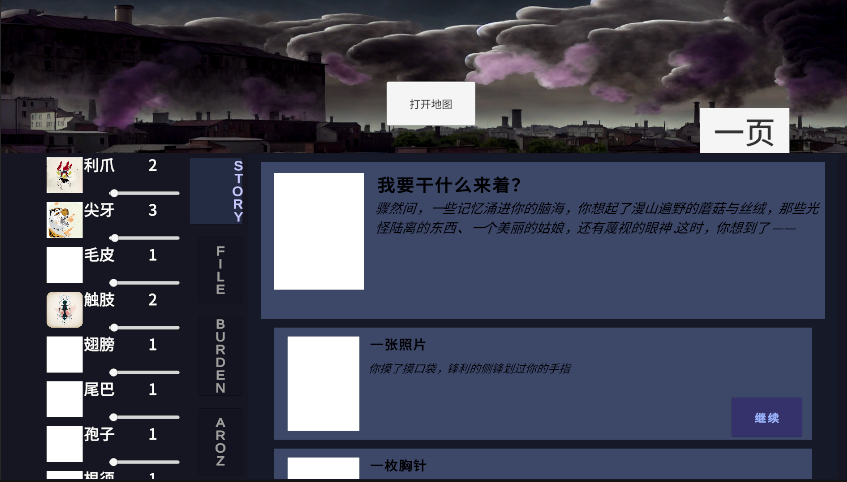
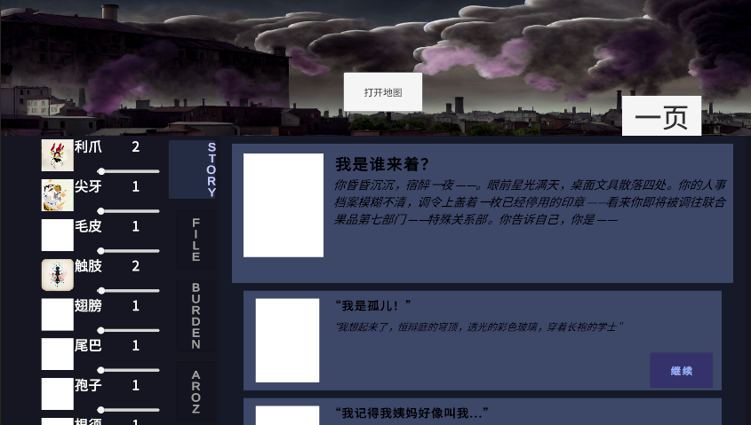
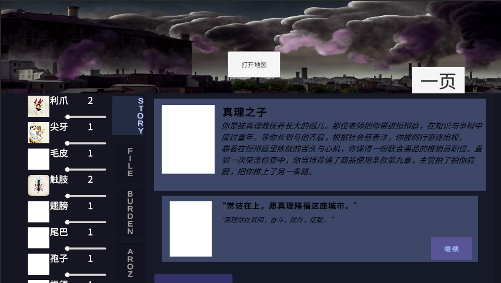
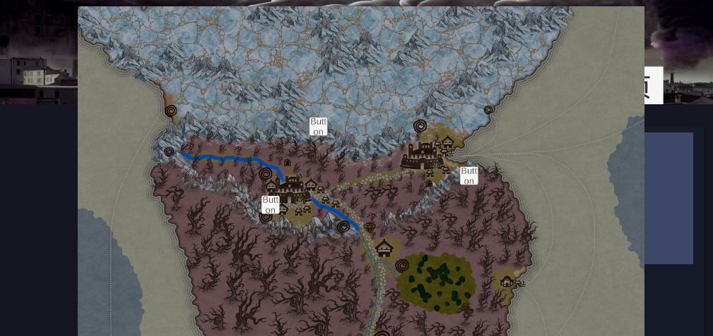
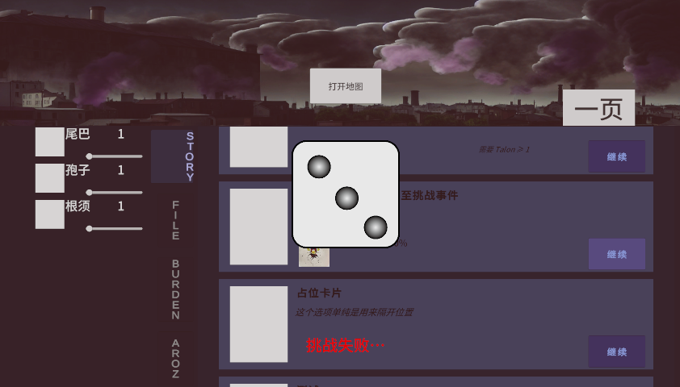

# 🏰 Cities

**Cities** 是一个基于 Unity 引擎开发的互动叙事游戏，融合了黑暗奇幻、美术风格与角色抉择机制。灵感来源于《Fallen London》《Sunless Sea》与中世纪幻想设定。

---

## 🎮 游戏特点

- ✒️ 自主编写的事件系统（支持分支剧情和抉择）
- 🧠 Trait 特质系统与挑战机制（事件成功率受角色影响）
- 🏙️ 美术风格采用手绘与贴图混合，具备复古蒸汽感
- 🎭 设有多个派系、志向和角色背景（支持剧情重玩）

---

## 🖼️ 项目截图



---

## 🛠️ 使用说明

### 克隆仓库：

```bash
git clone https://github.com/Szechuanese/FallenCastle.git
## 🖼️ 游戏截图集

### 📌 游戏主界面


### 🎭 事件与选项系统


### 🗺️ 地图导航机制


### 🧠 Trait 与挑战机制
